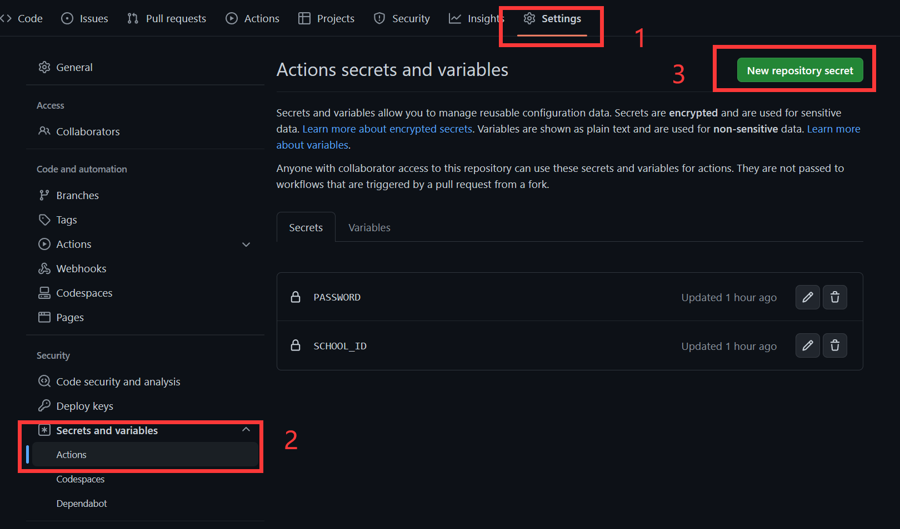
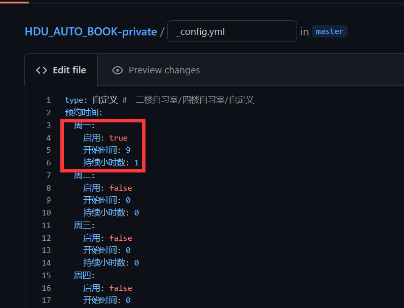
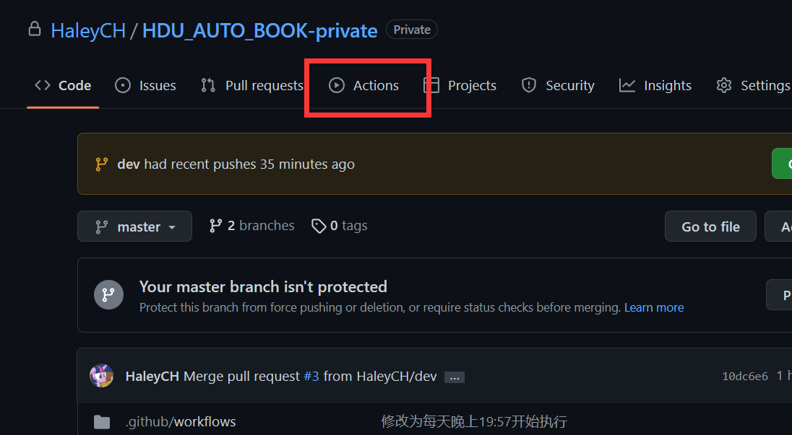

# HDU Auto Book 杭州电子科技大学图书馆自动预约脚本

*
 “当知识织就的茧房温柔剥落，你在图书馆沉淀的岁月自会羽化成风，托起你向青空而去的锋利轨迹。”  
*

> [!IMPORTANT]
> 请遵守以下使用协议,若不同意此协议，请移步其它项目
> 
 
 使用协议 

>
>  - 请合理使用此脚本，切勿占用公共资源，做出诸如预约但不去签到使用的行为。
>  - 本项目仅供学术交流使用，作者不对任何因使用本脚本造成的后果负责,包括但不仅限于由滥用脚本导致的封号，账号被锁定等。
>  - 本项目将停止维护并将被移除，当发生以下情况之一:
>    - 本项目被杭电图书馆或校方要求删除
>    - 作者发现本项目影响到了杭电图书馆正常的预约服务
>    - 作者发现本项目被滥用或有其他不妥之处
> - 当本项目被移除后，请各位使用者自觉停止使用fork的代码，以免造成不必要的麻烦。
> 

> [!NOTE]
> 经反馈，本脚本已不适配现图书馆系统。由于本人以无学生账号，故无法更新。欢迎各位提出pr进行更新。

> [!NOTE]
> 本脚本于`2025.4.4`进行了最后一次更新（新增自习室楼层），但本项目应该可以在很长一段时间内可以正常工作，大家可以自行配置下试试是否可用，若有人愿意接手本项目，可以邮件联系我。

- [配置](#配置)
- [设置预约时间](#设置预约时间设置预约时间)
- [启用脚本](#启用脚本)

## 视频教学

[https://github.com/HaleyCH/HDU_AUTO_BOOK-public/blob/V2/docs/tutorial.mp4](https://github.com/user-attachments/assets/03444438-6150-4b71-8f39-7d5f4eda3992)

## 配置
 1. fork本仓库
 2. 点击仓库中的 `setting` 标签， 选中 `Secrets` 选项卡
 3. 点击 `New repository secret` 按钮，新建环境变量。

   | 环境变量名| 说明        | 用途                                              |
   |:----------|:------------------------------------------------|:--------------|
   | `SCHOOL_ID` | 你的学号      | 用于登录[杭电智慧图书馆](https://hdu.huitu.zhishulib.com/) |
   | `PASSWORD` | 杭电智慧图书馆密码 | 用于登录[杭电智慧图书馆](https://hdu.huitu.zhishulib.com/) |
   | `SCKEY`（选填） | 微信推送服务    | 详见 [Sever酱](https://sct.ftqq.com/) 配置微信推送打卡结果   |

## 设置预约时间
 1. 点开 `user_config.yml` 文件
 2. 修改其中日期所对应的设置。

 | 名称      | 值                                | 功能        | 示范                       |
|---------|----------------------------------|-----------|--------------------------|
| `启用`    | `true`/`false`                   | 是否在该天预定座位 | 启用: true                 |
| `name`  | `二楼东`/`二楼西`/`四楼`/`三楼大厅`/`自定义`            | 预定座位位置    | name:二楼自习室               |
| `开始时间`  | 24小时对应数字                         | 使用座位开始时间  | 开始时间: 14 (代表预约下午两点开始的座位) |
| `持续小时数` | 数字                               | 使用座位小时数   | 持续小时数: 2                 |
| `自定义`   | yaml格式列表，内容为你喜欢的座位号（需设置type:自定义） | 使用自定义座位号  | 自定义：   -10001         |

 3. 保存文件并点击 `Commit changes` 按钮

## 启用脚本
 1. 点击仓库中的 `Actions` 标签
 2. 点击 `I understand my workflows, go ahead and enable them` 按钮

### 完成后它将于每天晚上 19:57 与 20:57 自动运行，开始预约。你也可以在 `Actions` 标签中手动运行。

### ❗Notice：由于GitHub不能保证cron完全准时，故该项目不适合用作抢座脚本。

# 致谢
- [杭州电子科技大学健康打卡脚本](https://github.com/YeQiuO/HDU_AUTO_PUNCH)

# 写在最后
这个简单的脚本伴我度过了在图书馆的日日夜夜，而如今终于抵达告别的码头。本来只是为了我能抢到座位而写的脚本，没想到在这几年间也多多少少帮了一些同学的忙，对此我深表荣幸。如今我即将离开校园，无法再更新本项目，对此本人感到非常抱歉。也在此祝愿各位热爱在图书馆学习的同学，*当知识织就的茧房温柔剥落，你在图书馆沉淀的岁月自会羽化成风，托起你向青空而去的锋利轨迹。*